# AMMA

**Telegram bot:** https://t.me/worldbank42_bot

**Web app:** https://amma-mauve.vercel.app

**A voice companion that helps a pregnant woman and her family remember the danger signs, agree what they will do, and act in time. It works on the family's phone with no internet.**

"Amma" means mother.

Many women do reach the clinic during pregnancy, but the visit is short and they go home without knowing which signs mean "go back now". When a sign does appear, the family loses hours deciding who takes her, where, and how. AMMA is five minutes a week, at home, in her own language:

1. She says the danger signs aloud. AMMA repeats only the ones she forgot.
2. It asks whether she has any of them today. She taps yes, no, or not sure.
3. If she says yes, it plays back the plan her family made in advance and offers one tap to call them.
4. It carries on after the birth, for the mother and the baby.

Everything AMMA says about danger signs comes from official health booklets, and the AI never decides whether she is well. Its main job is to understand what she says. There is one exception: when she asks about something the booklet does not cover, and she has agreed to online help, the AI writes a short general answer, shown apart and marked as written by an AI and not checked by a doctor.

She is often a woman who cannot easily read, whose internet comes and goes, and who gets only a few rushed minutes at the clinic. The signs she comes home without are ordinary and serious: heavy bleeding, a bad headache with blurred vision, the baby not moving. Knowing them is not the whole problem. The family still has to have agreed, in a calm moment, who decides, who takes her, and where they will go.

A week on the family's smartphone, with no internet, is about five minutes:

- She names the signs out loud, in her own language. AMMA repeats only the ones she missed.
- She says whether she has any of them today.
- She can ask a question by speaking. The answer is one from the booklet, or "Not sure, ask a person."
- A text goes to her basic phone: the next visit, the signs to watch, and who to call, for the days the smartphone is not at home.
- A short summary is there for the midwife, so the clinic minutes are spent on what she came to say.

The first time, the family makes the plan: who decides with her, who takes her, which clinic. After the birth, the same weekly session covers the mother and the newborn.

She reaches it in two ways. The offline app on the smartphone is the one that matters. WhatsApp, SMS, and a phone call offer the same session when she only has her basic phone, and those need a network.

<p align="center">
  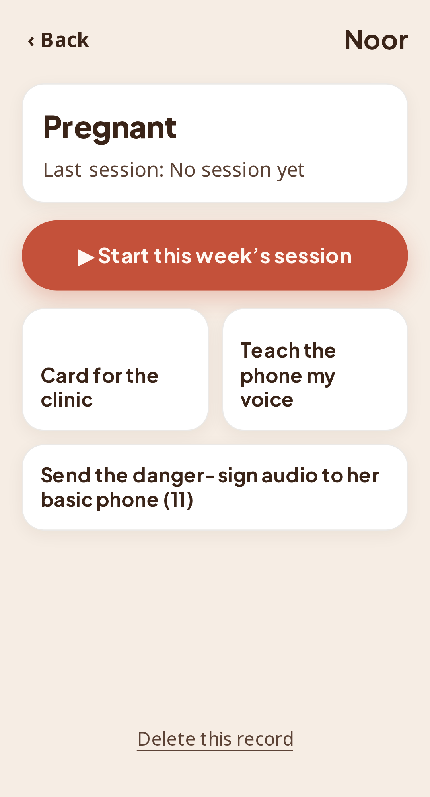
  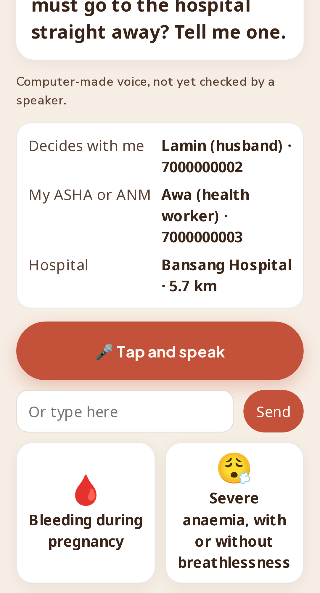
  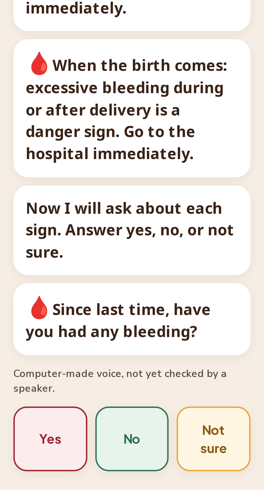
  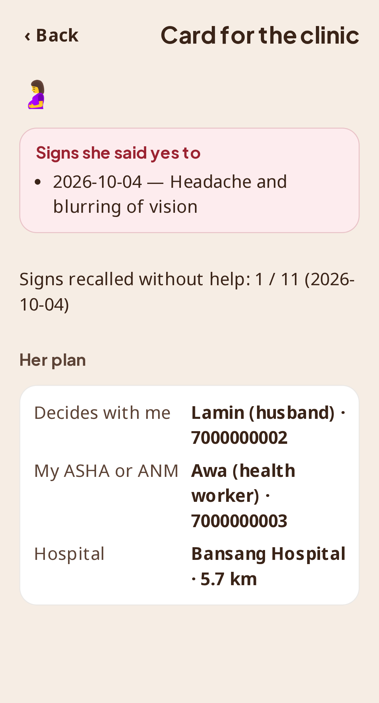
</p>
<p align="center"><sub>Her page · saying the signs back · the check · the card for the clinic. Screenshots are from the running app at phone size.</sub></p>

## Try it

| | |
|---|---|
| **Telegram bot** (same session by chat, voice notes and audio replies) | https://t.me/worldbank42_bot |
| **Web app** (works offline after the first visit; on Android, "Add to Home screen") | https://amma-mauve.vercel.app |
| **Messaging server** health check | https://amma-server.onrender.com/health |

The bot runs on a free server that sleeps when idle, so the first reply can take up to a minute. Send `/start` to choose a language and `/stop` to delete your record.

## Set it up

Node 24 and pnpm 11. This repository is one pnpm workspace: the session engine, the offline web app, and the messaging server.

```
git clone https://github.com/saurabh4269/amma.git
cd amma
corepack enable
pnpm install
```

The web app, at http://localhost:5173:

```
cd apps/web
pnpm packs       # turn the content and language packs into one file the app can load
pnpm dev
```

Checks, from the repository root:

```
pnpm test               # unit and property tests
pnpm packs:validate     # every health card has a source, and the outcome rules hold
cd apps/web
npx playwright test     # browser tests, including one with the network cut
```

The microphone is optional. From the repository root, this fetches the speech model, which is not stored here (about 10 MB):

```
./fetch-models.sh
```

"Find places near me" needs facility lists. From `apps/web`, `pnpm places` reads `data/health-transfer/`, which is not stored here. See `packs/place/`. The messaging server is a separate container; the steps are in `docs/DEPLOY.md`.

> **Status.** This is a working prototype built for the World Bank Small AI for Development hackathon (Health track). No clinician has reviewed the content, no native speaker has reviewed the translations or the audio, and it has never been used by a real patient. It must not be used for care as it stands. The section [What is not done](#what-is-not-done) lists every gap we know of.

---

## The problem, in one sentence

> Because of this tool, a pregnant woman will recognise a danger sign and act on a plan agreed with her family the same day, which she would otherwise do late; we know because women in The Gambia recalled two danger signs on average (2021 survey, 100 women), and in Kenya text messages raised knowledge of danger signs but did not change care-seeking (PROMPTS trial).

## Who it is for

Noor, from the hackathon brief: 38, farms two hectares, speaks a local language at home. The household has two phones. Hers does calls, SMS and mobile money. Her daughter's smartphone is home at weekends. There is no Wi-Fi. The clinic is near, overcrowded, and has little time for each patient.

AMMA is built around exactly that:

- **The smartphone, at the weekend:** the weekly session, offline.
- **Her basic phone, on weekdays:** an SMS with the signs to watch and who to call, and the danger-sign audio sent across by Bluetooth so she can replay it with no network.
- **The clinic visit:** one screen she shows the midwife, with what she reported and her open questions.

## Why this problem

Between a complication and treatment there are five links. The evidence says the chain breaks in the middle.

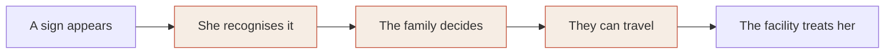

| Link | What is known |
|---|---|
| She recognises it | In The Gambia about 4 in 5 women have four or more antenatal visits, yet women recalled two danger signs on average and rarely named headache or blurred vision, the signs of pre-eclampsia. |
| The family decides | In the PROMPTS trial in Kenya (40 facilities, 6,139 women), messages raised danger-sign knowledge by 3.6 points and did not change care-seeking for danger signs. Knowing is not enough. |
| They can travel | Our own analysis of The Gambia: 81% of people live within 5 km of some facility, but only 28% within 5 km of a hospital on the official list. |
| After the birth | WHO's 2022 postnatal guideline notes that most maternal and newborn deaths occur in the first three days after birth. Most tools stop at delivery. |

So AMMA does three things other tools mostly do not: it makes her **recall** the signs instead of only hearing them, it has the family agree a **plan** in calm time, and it **continues for six weeks after the birth**.

## What a session looks like

**First time only: the plan.** Who decides with her, who goes with her, who her health worker is, which hospital, what transport, whether money is set aside. For the hospital, "Find places near me" suggests the nearest facilities and, separately, the nearest hospital.

<table>
<tr>
<td width="250">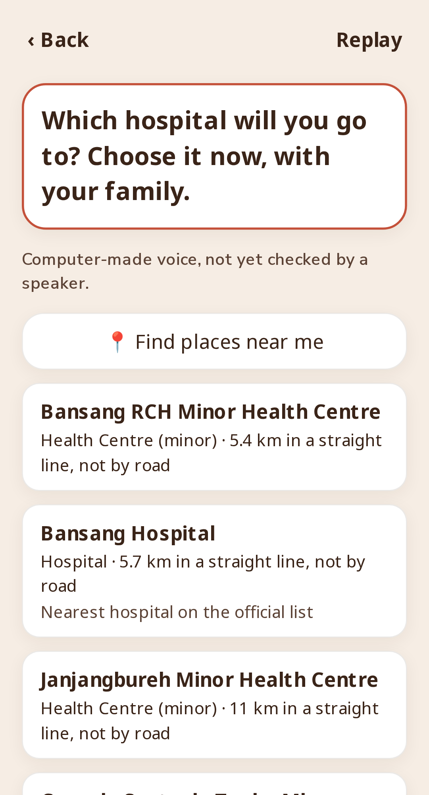</td>
<td>
<b>The hospital step, near Bansang in The Gambia.</b><br><br>
The nearest place is a minor health centre. The nearest <i>hospital</i> on the official list is a different place, and is labelled.<br><br>
Distances say "in a straight line, not by road", because that is all the data supports. The family can pick a suggestion or type their own choice.
</td>
</tr>
</table>

**Every week, about five minutes:**

| Step | What happens | Who decides the result |
|---|---|---|
| Say it back | "Which signs mean you must go to the hospital straight away?" She answers by voice, by tapping a picture, or a helper types. AMMA replays only the signs she missed, and brings missed ones back sooner. | The model suggests, she confirms |
| Check | One question per sign: "Since last time, have you had…?" Yes, No, Not sure. | Her answers and a fixed rule table |
| Ask | She can ask a question or describe what is wrong. For a vague complaint AMMA asks a few follow-ups (where, since when, how strong) and says it back as one clear sentence for the clinic. Details already in her words ("back pain since two days") are filled in, not asked again. If the booklet has no card for it, a short AI-written answer follows under a caution. | The model suggests, she confirms |
| Outcome | One of four spoken results (below). | Fixed rule table only |
| Carry over | A ready-written SMS to her basic phone: next visit, signs to watch, who to call. | |

**The four outcomes:**

- **Any "yes" on a danger sign:** "Go to the nearest appropriate hospital immediately." Her plan is shown, with one tap to call each person in it.
- **A "yes" on a less urgent sign** (for example a breast problem or an infected cord): "Go to the health centre as soon as possible", with one tap to call her health worker.
- **Any "not sure":** "Speak to your health worker today."
- **All "no":** "None of the listed danger signs today. Problems can come without warning, so if you are worried, speak to your health worker." It never says she is fine.

<table>
<tr>
<td align="center">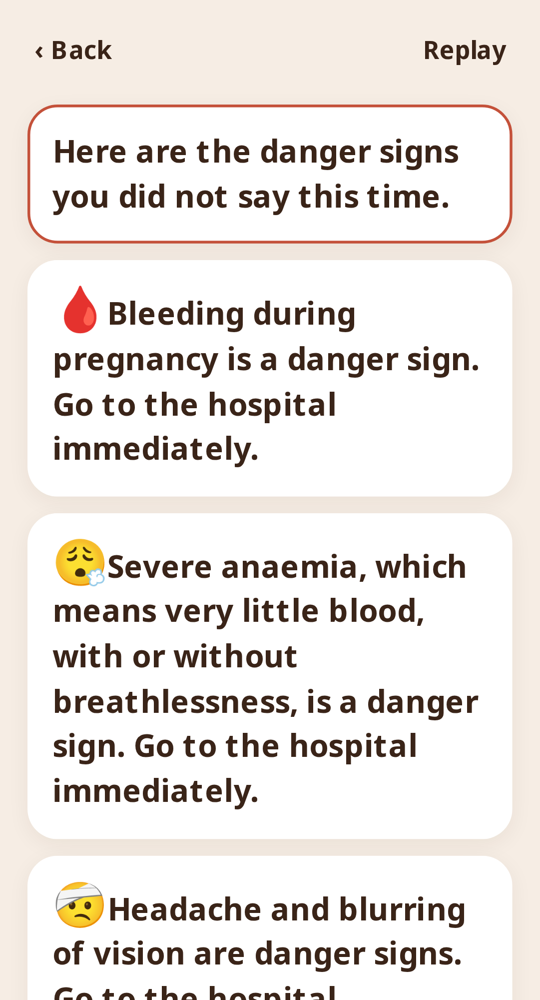<br><sub>She named one sign. Only the ones she missed are replayed.</sub></td>
<td align="center">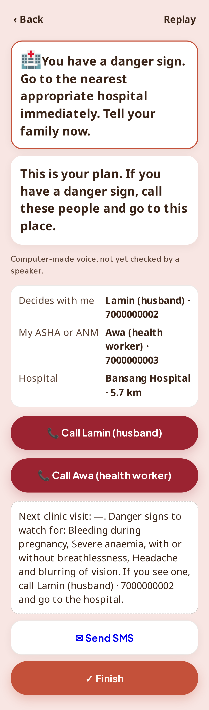<br><sub>A "yes": the instruction, her own plan, one tap to call, and the SMS for her basic phone.</sub></td>
<td align="center">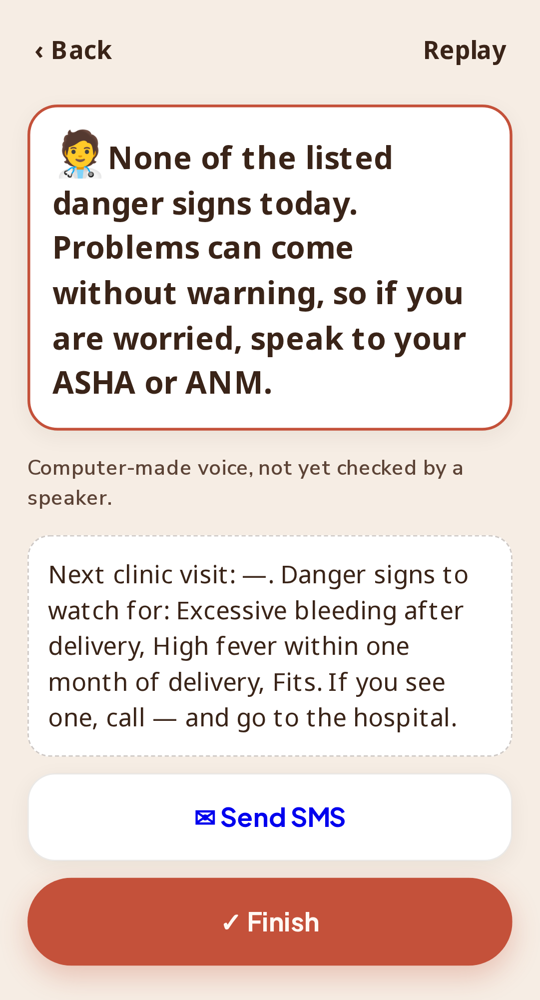<br><sub>All "no": it says none of the listed signs, and who to ask. It never says she is fine.</sub></td>
</tr>
</table>

**After the birth** the same session covers six signs for the mother and eight for the baby, on the home-visit days (1, 3, 7, 14, 21, 28, 42).

**What the pack contains today:** 32 signs, 20 questions she can ask, 12 complaints she can describe, and 8 optional tracks (pregnancy care, first pregnancy, anaemia, diabetes in pregnancy, free entitlements, care after birth, family planning, immunisation). That is 256 cards, of which 167 carry health content, each tied to an exact quote and page in an official source.

## Where the AI is, and why a simpler tool would not do

**What the AI does.** There are three uses, and only the first runs without a network.

1. **Hearing her, on the phone.** A 10 MB speech model turns her speech into one of a fixed list of known meanings, or says it does not know. No network, nothing leaves the phone.
2. **Understanding her, online.** With a connection and her consent (asked once in the app, stated in the bot's first message), her voice goes to a speech service (ElevenLabs) to become text. Words the phrase list does not know go to a language model (OpenAI) that picks which listed meaning she intends, or none. The same model reads details she already gave, so "strong back pain since two days" is not followed by "where is the pain?". It works at every step: she can name her language, say "my baby came last week", or describe a problem in the middle of the check and be returned to where she was.
3. **Answering where the booklet is silent, online.** The national card has nothing on back pain, nausea or what to eat. For a problem she described that led to no danger sign, or a health question no card answers, the model writes up to four short sentences of general comfort and self-care. This is the only place a model writes words she reads. It is shown apart from the cards under a fixed caution: written by an AI, not from the official booklet, not checked by a doctor, ask your health worker before acting on it.

**Why not a menu, SMS, a spreadsheet or a search:**

- **Recall cannot be graded by a menu.** A list of signs shows her the answers. What she needs on a Tuesday, with no phone in her hand, is to have them in her head, and checking that means understanding what she says.
- **She may not read.** Rural illiteracy in Senegal is 62.7% (ANSD 2021).
- **A search returns unvetted text** and needs data and reading.
- **"It hurts here" is not a search query.** Turning a vague complaint into a clear description takes a conversation.

**The guardrail: the model can raise a flag, never clear one.**

| The model may | The model may never |
|---|---|
| Suggest which sign, question or problem she meant, for her to confirm | Decide the outcome |
| Fill in details already in her words, which she confirms in a summary | Write or reword anything about a danger sign |
| Add an explicit yes/no question for a sign | Say a symptom is harmless, normal or nothing to worry about |
| Read her words as "yes" to a danger sign | Count her words as "no" or "not sure" to a danger sign: that must be tapped |
| Write a short general answer where no card exists, under a caution | Name a medicine or a dose, diagnose, or tell her she need not see anyone |
| Say "Not sure. Ask a person." | Change a "yes" she gave |

How each side is held:

1. **A fixed list of answers.** Every sentence the session engine can say is a numbered card with a source. A property test feeds the engine random input and checks that it never says anything that is not a card. The AI-written answer is produced outside the engine, cannot change its state, and is never the outcome.
2. **The picker can only pick.** The model's reply is limited by a schema to the ids it was offered or "none", and the server checks again that the id was on the list. A detail or option it invents is dropped.
3. **The written answer is fenced by instruction, not by proof.** It is told: general comfort only, no medicine or dose, no diagnosis, never "you are fine", always send her to a health worker, and if her words sound like an emergency say only "go now". Nothing checks that text after it is written. That is why it carries a caution, why it is off without her consent and without a network, and why one server setting (`AI_ANSWERS=off`) returns the product to cards only. It has had no clinical review.

4. **Names stay private.** Names and phone numbers given for the family plan are not sent to the model.
5. **Rules proven by exhaustion.** Before a content pack can be built, a validator tries every combination of yes / no / not sure and refuses the pack if any "yes" is not urgent, any "not sure" does not reach a person, or any health card lacks a source.
6. **Voice always asks.** Our benchmark (below) showed the small model cannot tell when it is wrong, so a voice match is never accepted alone. AMMA plays its guess back ("Did you say: high fever?") and she answers. A described problem is confirmed in the summary it reads back ("Pain, in the back, strong, for a few days. Is this right?").

## What we measured, including what did not work

### The speech model

We tested the on-device approach on 3,204 Wolof recordings (WolBanking77: banking phrases, 16 speakers, not health speech). The protocol was written before any result was seen (`research/reports/protocol.md`). Speakers in the test were never among the examples.

| Examples per meaning | Right meaning (chance is 10%) |
|---|---|
| 1 | 29.5% |
| 3 | 43.6% |
| 5 | 50.9% |
| 10 | 63.3% |

- The model's confidence is unusable: with ten examples, only 1.6% of recordings could be accepted without asking at a 1% error rate.
- Noise at 10 dB costs about 10 points; telephone-quality audio about 3.
- The 10 MB compressed model is within 0.3 points of the full one.
- **The bar we set in advance (no danger-to-harmless errors while accepting 70%) was not met.** That is why pictures and typing are the dependable route and voice always confirms.
- An extra check written after the first results (so exploratory): when the examples include the same phrases said by other people, it is right 81 to 87% of the time with three to five speakers. So it works as a phrase matcher, and the app stores each confirmed phrase on her phone to learn her own words.

Not measured: health phrases, Hindi, Marathi, out-of-scope speech, a real low-end phone. Full report: `research/reports/wolbanking77-fewshot.md`. Model card: `docs/submission/MODEL_CARD.md`.

### Distance to care in The Gambia

Computed from the WorldPop 2020 population grid (2.43 million people) and the facility lists (`research/access/gambia_access.py`):

| Straight-line distance to | Within 5 km | Within 10 km | Median |
|---|---|---|---|
| Any listed facility | 81% | 96% | 2.3 km |
| A hospital on the official list | 28% | 44% | 13.2 km |

These are straight lines. The river, roads and seasons are ignored, so real journeys are longer. The finding shapes the product: for bleeding or fits, the nearest clinic and the nearest hospital are different answers, so the plan step shows both.

## How it meets the hackathon's rules

| Rule | How AMMA meets it | Where to check |
|---|---|---|
| Runs on a device she already has | The household smartphone; her basic phone gets the SMS and the audio | Live app |
| Core feature works offline | The whole session runs with no network after the first visit | Browser test "works with no network after the first visit" |
| Model small enough to side-load | 10.1 MB speech model. First open downloads about 25 MB; each language's audio (about 5 MB) follows in the background | `fetch-models.sh` |
| An interaction in a named local language | Hindi and Marathi, by text and audio. Also French, Swahili, Hausa and Wolof as drafts | Language picker |
| A less-supported language | A language is a data pack: wording, audio, example phrases. Wolof has no supported voice, so it shows the limit: text only | `packs/lang/wo` |
| "Not sure, ask a person" | Spoken whenever a match is weak or she answers "not sure" | Outcome rules |
| A person makes the final call | The outcome comes only from her answers; the action is her family's | Engine tests |
| Where the data sits | On the phone, no account, no server; optional PIN that encrypts the record | `apps/web/src/store.ts` |
| Lost or shared phone | Nothing in a cloud to leak; the PIN protects the record; the app says aloud that anyone who can open the phone can see it | Setup screen |
| No image interpretation | None. The camera is not used for health | |

## Evidence that the problem is real

| Fact | Source, year, place |
|---|---|
| Women recalled two pregnancy danger signs on average; 77% had low awareness; 76% owned a smartphone; 40% had reliable internet | Survey at four health centres, 2021, The Gambia (100 women) |
| About 4 in 5 women had 4+ antenatal visits; 84% of births in a facility | DHS 2019-20, The Gambia † |
| Messages raised danger-sign knowledge by 3.6 points; no change in care-seeking for danger signs | PROMPTS cluster randomised trial, Kenya |
| Haemorrhage about 29% and hypertensive disorders about 22% of maternal deaths | WHO analysis of 2009-20, sub-Saharan Africa † |
| Most maternal and newborn deaths occur in the first three days after birth | WHO postnatal guideline, 2022 |
| 58% of mothers had 4+ antenatal visits; 89% facility births; 54% of women have a phone they use | NFHS-5, 2019-21, India † |
| Maternal deaths per 100,000 live births: The Gambia 354, Senegal 237 | World Development Indicators, 2023 |
| 28% of people within 5 km of an official-list hospital | Our analysis, WorldPop 2020, The Gambia |

† Read from a published summary of the source, not from the source itself.

## Data it is built with, and what that data does not cover

| Data | Used for | Licence | What it does not cover |
|---|---|---|---|
| India Mother and Child Protection card, 2018, and its guidebook | Signs, advice, outcomes | Not stated in the documents | Any country but India. No Marathi edition was found |
| WHO guide for essential practice, 2015 | Four of the mother's after-birth signs; the "see a worker soon" signs | All rights reserved; short phrases quoted for attribution, permission not yet requested | |
| WHO postnatal guideline, 2022 | Newborn jaundice sign | CC BY-NC-SA 3.0 IGO | |
| India gestational diabetes and anaemia guidelines | Condition tracks | Free reproduction with acknowledgement; not stated | Advice written for health workers, not for mothers |
| WolBanking77 audio | Testing the speech method | CC BY 4.0 | Health speech; pregnant speakers; Hindi, Marathi |
| Maina et al. facility list | Facility levels, The Gambia and Senegal | Unknown in our data manifest | India; private facilities; whether a facility is open |
| healthsites.io and OpenStreetMap | Facility points, incl. 10,599 in Maharashtra | ODbL | Reliable facility types; half of The Gambia's points have no coordinates |
| WorldPop 2020 grid, The Gambia | Distance analysis | See source | Roads, the river, seasons |
| ElevenLabs voices | Card audio in six languages | Service terms | Wolof is not supported |

Every quote, with page number, is in `content-sources/extracts.md`. The full data sheet is `docs/submission/DATA_SHEET.md`.

**Gaps in the sources that changed the product:**

- The Hindi and English editions of the Indian card differ (the Hindi one adds vomiting and drops "labour pain before term"), so Hindi wording must come from the Hindi card, not from translation.
- The Indian card lists only two after-birth signs for the mother and omits newborn jaundice; both were filled from WHO.
- No open dataset says whether a clinic is open or staffed today. AMMA does not claim to know.
- We could not obtain Senegal's mother-and-child booklet, so there is no Senegal content yet.

## Languages

| Language | Wording | Audio | Reviewed by a speaker |
|---|---|---|---|
| English | Reference wording | Computer-made | No |
| Hindi | Draft, following the official Hindi card where it exists | Computer-made | No |
| Marathi | Draft | Computer-made | No |
| French | Draft | Computer-made | No |
| Swahili | Draft | Computer-made | No |
| Hausa | Draft | Computer-made | No |
| Wolof | Draft, the least reliable | None | No |

The app shows "draft wording" and "computer-made voice, not yet checked by a speaker" on screen. All seven languages currently speak the Indian content; a Kenyan or Senegalese version needs that country's own booklet as a content pack.

Adding a language needs no code: a folder with the wording, example phrases and audio, checked by `pack-tools`.

<p align="center">
  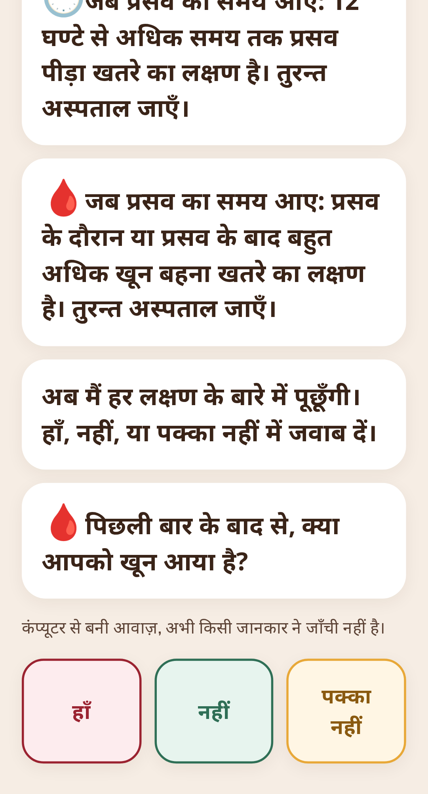
  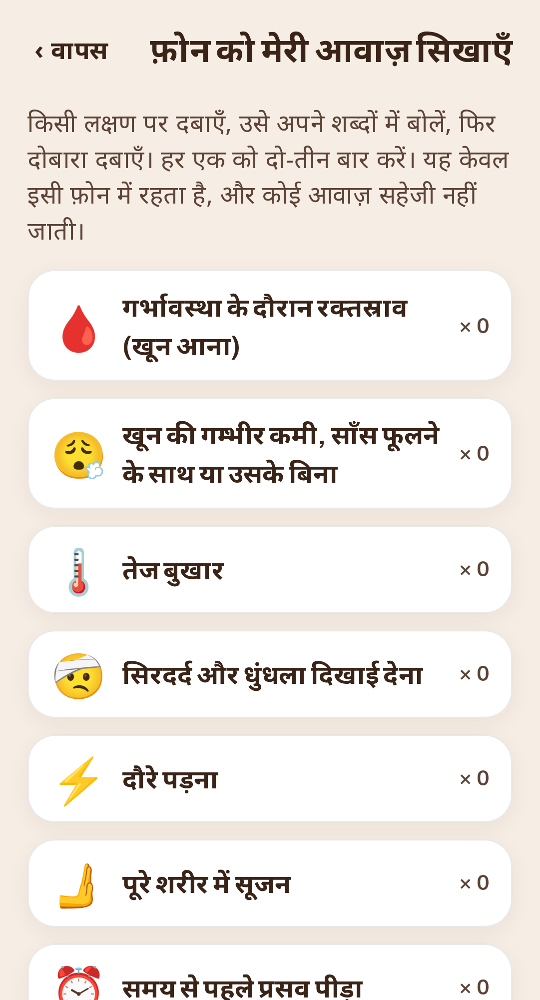
  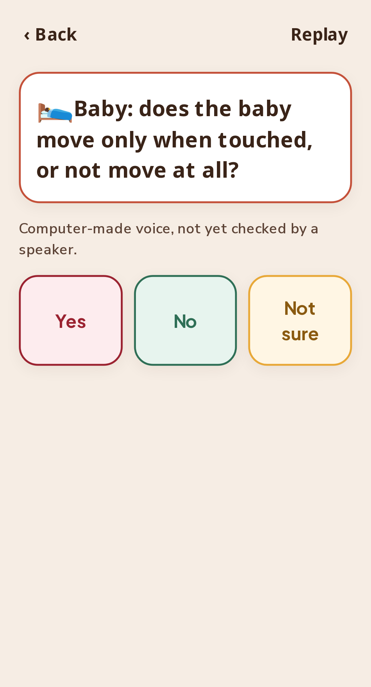
</p>
<p align="center"><sub>The check in Hindi · "teach the phone my voice", where she says each sign in her own words · a newborn question after the birth.</sub></p>

## Channels

| Channel | Status |
|---|---|
| **Offline web app** | Live. This is the core feature. |
| **Telegram bot** | Live. Text, buttons, voice notes (transcribed by ElevenLabs, then matched to the same fixed phrases, with a language model for words the phrases do not know) and voice replies. It understands free words at every step, and gives the marked AI-written answer where no card exists. |
| **WhatsApp and SMS** | Built and tested against simulated requests. Not live: the Twilio trial account cannot send free-text WhatsApp replies. |
| **Phone calls, and missed call with call back** | Built and tested against simulated requests. Not live: needs a purchased number. |

All channels run the same engine and the same cards. The picture of that split is in [How it is built](#how-it-is-built). Server channels keep answers under the phone number, keep no message text or audio, begin with a consent message, and delete everything on "STOP".

## Responsible AI

- **Fail-safe:** a weak match gives "Not sure. Ask a person", never a guess.
- **Human in the loop:** she confirms every voice match; the outcome is her own answers; the family acts.
- **Generated text is the exception, and it is labelled:** everything about danger signs, the check and the outcome is a sourced card. Only where no card exists does a model write a short general answer, under a caution that it is from an AI, not from the booklet, and not checked by a doctor. Its limits are instructions to the model and are not verified afterwards.
- **Privacy on the phone:** no account, no server, audio discarded after matching, optional encrypted PIN, nothing on the lock screen.
- **Privacy online:** voice goes to a speech service and unrecognised words to a language model; the consent says so, in the app and in the bot's first message. Names and phone numbers for the plan are not sent to the model.
- **Bias and language limits:** measured on Wolof banking speech only; nothing measured for Hindi or Marathi; six of seven voices are synthetic and unreviewed.
- **Honest labels:** each card carries "from published source" or "clinician approved". Today every card is the former.

Full statement: `docs/submission/RESPONSIBLE_AI.md`.

## What is not done

- **No clinical review.** Turning a booklet into spoken cards and rules involves judgment a clinician must check. Splitting the card's combined signs into single yes/no questions is one such judgment.
- **No native-speaker review** of any translation or audio clip.
- **No user testing** with pregnant women, families or health workers.
- **No evidence of impact.** We measure recall and plans made; we make no claim about deaths.
- **Voice is weak** (see the benchmark) and unmeasured in Hindi, Marathi and on a real low-end phone.
- **Content is India only.** No Senegal, Gambia or Solomon Islands protocol.
- **Distances are straight lines**, not travel times, and no data says whether a clinic is open.
- **No myth cards:** we found no official source for the corrections, and a card without a source does not ship.
- **The messaging server** is on a free host that sleeps and loses its records on restart.
- **Setup and the plan need typing**, so a helper who can read is needed once.

## How it is built

The phone is the product. The server is another door. Both call one function, and the model never chooses the outcome.

<p align="center">
  
</p>
<p align="center"><sub>Drawn in Excalidraw. Source: <code>docs/architecture/amma.excalidraw</code></sub></p>

**On the family's phone.** No account. After the first visit, no network. Three things stay on the device: the session (plan, recall, the check, a question, the clinic card), the app and the packs cached so it still opens offline, and Whisper-tiny, a 10 MB model that runs on the phone. It may suggest which sign she said. The app plays that guess back and she confirms it. The same phone can hand her basic phone an SMS, a call, and the danger-sign audio over Bluetooth. The app is hosted on Vercel.

**Messaging server.** Fastify on Node, one SQLite file, and it sleeps when idle. Telegram is live: text, buttons, voice notes, and audio replies. WhatsApp, SMS, calls, and a missed call that rings back are built through Twilio and are not live. The database keeps her number and her answers. It keeps no message text and no audio. A voice note goes to ElevenLabs, then the text is matched to the same fixed phrases as typed words. The server ships as Docker on Render. The two arrows mean the same thing both ways: her action goes in, and the next thing to say or show comes out.

**Shared core.** The phone and the server run the same code. `step(state, event)` returns the next state and the effects to play or show. The path is plan, then recall, then the check, then a question, then the outcome. `@amma/matcher` accepts a match, asks her to confirm, or abstains. `@amma/schema` is one definition of the packs and of her record, so the two doors cannot drift apart.

**What that function reads (four cards).** A new language, or a new country's booklet, is a folder. None of this is invented during the session.

- **Content:** 256 cards from India's mother-and-child booklet, plus WHO. Every health card has a source.
- **Languages:** seven folders. Wolof has wording but no voice clips.
- **Places:** clinics and hospitals for The Gambia, Senegal, and Maharashtra, kept separate.
- **ElevenLabs:** one audio clip per card, made once and played back. No card audio is generated while she is talking.

**Before a pack can ship.** None of this runs during a session. `pack-tools` refuses a card with no source, and refuses a pack if a "yes" on a danger sign is not urgent. `place-tools` builds the facility lists from official lists and OpenStreetMap (10,599 places in Maharashtra). The research harness runs WolBanking77 with the protocol written first, and the straight-line distance check for The Gambia.

**The line the model may not cross.** It may suggest which sign she said. She confirms it. A fixed table chooses go now, go soon, ask a person, or none of the listed signs. It never says she is fine, and it never writes or rewords anything about a danger sign. A test checks that every sentence the engine says is a card. The one thing a model does write is the short general answer where no card exists, online, with her consent, and under a caution; it sits outside the engine and cannot change the outcome.

```
packages/
  schema        definitions of content packs, language packs, place packs and records
  engine        the session as a pure state machine; rules; repeat scheduler; symptom clarifier; pack validator
  matcher       typed-text matching; accept / confirm / abstain
  speech        on-device speech: features, encoder, nearest-example scoring
  channel-text  the same session over any text channel
  pack-tools    validate and build packs; generate card audio
  place-tools   build facility lists from public data
apps/
  web           the offline web app
  server        Twilio and Telegram webhooks
packs/
  content/in-mch   the India content pack
  lang/            en, hi, mr, fr, sw, ha, wo
  place/           The Gambia, Senegal, Maharashtra
research/          speech benchmark, access analysis, reports
content-sources/   exact quotes and page numbers behind every card
docs/              plan, build notes, deployment, submission documents
```

- **One engine, every channel.** The session is a single function from (state, event) to (state, effects). The phone app, the bot and the call handler only render effects, so they cannot disagree about the rules.
- **Nothing is hardcoded.** Card text, rules, languages, thresholds and limits are data in packs, checked on every build.
- **Tests:** 63 unit and property tests, and 9 browser tests, including one that cuts the network and one that plays a real Wolof recording in as the microphone.
- **Stack:** TypeScript, Preact, Vite, ONNX Runtime Web, Fastify, SQLite; Python for the research.

## What happens next

1. Clinical review of the Indian pack, and a Hindi and Marathi speaker's review of wording and audio.
2. A recall study: signs recalled unprompted before and after four weekly sessions, against the published baseline of two.
3. A Senegal or Gambia content pack from the national booklet, with Wolof recorded by people.
4. Better voice: recordings of the real sign phrases from several speakers per language, and a small trained layer on the frozen encoder.
5. Road travel times in place of straight lines.
6. A clinic-side reader for the clinic card, in the open health record format.

**Why it can scale:** a ministry or NGO owns its content and language packs; the code is open; the offline app costs nothing per woman after install; and the content is the booklet ministries already print.

**Sustainable Development Goals:** 3.1 (maternal deaths), 3.2 (newborn deaths), 3.7 (reproductive health information), 3.8 (coverage of essential services), 5.b (technology for women), 10.2 (inclusion by language and literacy). We measure the steps before those outcomes: signs recalled, plans made, visits kept.

## More detail

| Document | What it covers |
|---|---|
| `docs/PLAN.md` | The reasoning, evidence and design decisions, in full |
| `docs/submission/SUBMISSION.md` | Each judging criterion, the evidence for it, and our weakest point |
| `docs/submission/DATA_SHEET.md` | Every dataset, licence and gap |
| `docs/submission/MODEL_CARD.md` | The speech model and its measured limits |
| `docs/submission/RESPONSIBLE_AI.md` | Safety, privacy and oversight |
| `research/reports/` | Benchmark protocol, results and the access analysis |

## Licences

Code is Apache-2.0. Our own wording is CC BY 4.0. Quoted source text belongs to its publishers. See `NOTICE.md` for the details, including the parts that are non-commercial or all rights reserved.

Built by Saurabh Gupta (IIT Bombay) and Shiwani Mishra.
