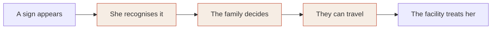

# AMMA

**A voice companion that helps a pregnant woman and her family remember the danger signs, agree what they will do, and act in time. It works on the family's phone with no internet.**

"Amma" means mother.

Many women do reach the clinic during pregnancy, but the visit is short and they go home without knowing which signs mean "go back now". When a sign does appear, the family loses hours deciding who takes her, where, and how. AMMA is five minutes a week, at home, in her own language:

1. She says the danger signs aloud. AMMA repeats only the ones she forgot.
2. It asks whether she has any of them today. She taps yes, no, or not sure.
3. If she says yes, it plays back the plan her family made in advance and offers one tap to call them.
4. It carries on after the birth, for the mother and the baby.

Everything AMMA says comes from official health booklets. The AI's only job is to understand what she says. It never writes advice and never decides whether she is well.

## Try it

| | |
|---|---|
| **Web app** (works offline after the first visit; on Android, "Add to Home screen") | https://amma-mauve.vercel.app |
| **Telegram bot** (same session by chat, voice notes and audio replies) | https://t.me/worldbank42_bot |
| **Messaging server** health check | https://amma-server.onrender.com/health |

The bot runs on a free server that sleeps when idle, so the first reply can take up to a minute. Send `/start` to choose a language and `/stop` to delete your record.

> **Status.** This is a working prototype built for the World Bank Small AI for Development hackathon (Health track). No clinician has reviewed the content, no native speaker has reviewed the translations or the audio, and it has never been used by a real patient. It must not be used for care as it stands. The section [What is not done](#what-is-not-done) lists every gap we know of.

---

## The problem, in one sentence

> Because of this tool, a pregnant woman will recognise a danger sign and act on a plan agreed with her family the same day, which she would otherwise do late; we know because women in The Gambia recalled two danger signs on average (2021 survey, 100 women), and in Kenya text messages raised knowledge of danger signs but did not change care-seeking (PROMPTS trial).

## Who it is for

Noor, from the hackathon brief: 38, farms two hectares, speaks a local language at home. The household has two phones. Hers does calls, SMS and mobile money. Her daughter's smartphone is home at weekends. There is no Wi-Fi. The clinic is near, overcrowded, and has little time for each patient.

AMMA is built around exactly that:

- **The smartphone, at the weekend:** the weekly session, offline.
- **Her basic phone, on weekdays:** an SMS with the signs to watch and who to call, and the danger-sign audio sent across by Bluetooth so she can replay it with no network.
- **The clinic visit:** one screen she shows the midwife, with what she reported and her open questions.

## Why this problem

Between a complication and treatment there are five links. The evidence says the chain breaks in the middle.



| Link | What is known |
|---|---|
| She recognises it | In The Gambia about 4 in 5 women have four or more antenatal visits, yet women recalled two danger signs on average and rarely named headache or blurred vision, the signs of pre-eclampsia. |
| The family decides | In the PROMPTS trial in Kenya (40 facilities, 6,139 women), messages raised danger-sign knowledge by 3.6 points and did not change care-seeking for danger signs. Knowing is not enough. |
| They can travel | Our own analysis of The Gambia: 81% of people live within 5 km of some facility, but only 28% within 5 km of a hospital on the official list. |
| After the birth | WHO's 2022 postnatal guideline notes that most maternal and newborn deaths occur in the first three days after birth. Most tools stop at delivery. |

So AMMA does three things other tools mostly do not: it makes her **recall** the signs instead of only hearing them, it has the family agree a **plan** in calm time, and it **continues for six weeks after the birth**.

## What a session looks like

**First time only: the plan.** Who decides with her, who goes with her, who her health worker is, which hospital, what transport, whether money is set aside. For the hospital, "Find places near me" suggests the nearest facilities and, separately, the nearest hospital.

**Every week, about five minutes:**

| Step | What happens | Who decides the result |
|---|---|---|
| Say it back | "Which signs mean you must go to the hospital straight away?" She answers by voice, by tapping a picture, or a helper types. AMMA replays only the signs she missed, and brings missed ones back sooner. | The model suggests, she confirms |
| Check | One question per sign: "Since last time, have you had…?" Yes, No, Not sure. | Her answers and a fixed rule table |
| Ask | She can ask a question or describe what is wrong. For a vague complaint AMMA asks a few follow-ups (where, since when, how strong) and says it back as one clear sentence for the clinic. | The model suggests, she confirms |
| Outcome | One of four spoken results (below). | Fixed rule table only |
| Carry over | A ready-written SMS to her basic phone: next visit, signs to watch, who to call. | |

**The four outcomes:**

- **Any "yes" on a danger sign:** "Go to the nearest appropriate hospital immediately." Her plan is shown, with one tap to call each person in it.
- **A "yes" on a less urgent sign** (for example a breast problem or an infected cord): "Go to the health centre as soon as possible", with one tap to call her health worker.
- **Any "not sure":** "Speak to your health worker today."
- **All "no":** "None of the listed danger signs today. Problems can come without warning, so if you are worried, speak to your health worker." It never says she is fine.

**After the birth** the same session covers six signs for the mother and eight for the baby, on the home-visit days (1, 3, 7, 14, 21, 28, 42).

**What the pack contains today:** 32 signs, 20 questions she can ask, 12 complaints she can describe, and 8 optional tracks (pregnancy care, first pregnancy, anaemia, diabetes in pregnancy, free entitlements, care after birth, family planning, immunisation). That is 254 cards, of which 167 carry health content, each tied to an exact quote and page in an official source.

## Where the AI is, and why a simpler tool would not do

**What the AI does:** it turns her speech into one of a fixed list of known meanings, or says it does not know. On the phone this is a 10 MB speech model that runs with no network.

**Why not a menu, SMS, a spreadsheet or a search:**

- **Recall cannot be graded by a menu.** A list of signs shows her the answers. What she needs on a Tuesday, with no phone in her hand, is to have them in her head, and checking that means understanding what she says.
- **She may not read.** Rural illiteracy in Senegal is 62.7% (ANSD 2021).
- **A search returns unvetted text** and needs data and reading.
- **"It hurts here" is not a search query.** Turning a vague complaint into a clear description takes a conversation.

**The guardrail: the model can raise a flag, never clear one.**

| The model may | The model may never |
|---|---|
| Suggest which sign or question she said, for her to confirm | Decide the outcome |
| Choose the next clarifying question | Write or reword advice |
| Add an explicit yes/no question for a sign | Say a symptom is harmless |
| Say "Not sure. Ask a person." | Change a "yes" she gave |

Three mechanisms enforce it:

1. **A fixed list of answers.** Every sentence AMMA can say is a numbered card with a source. A property test feeds the engine random input and checks that it never says anything that is not a card.
2. **Rules proven by exhaustion.** Before a content pack can be built, a validator tries every combination of yes / no / not sure and refuses the pack if any "yes" is not urgent, any "not sure" does not reach a person, or any health card lacks a source.
3. **Voice always asks.** Our benchmark (below) showed the small model cannot tell when it is wrong, so a voice match is never accepted alone. AMMA plays its guess back ("Did you say: high fever?") and she answers.

## What we measured, including what did not work

### The speech model

We tested the on-device approach on 3,204 Wolof recordings (WolBanking77: banking phrases, 16 speakers, not health speech). The protocol was written before any result was seen (`research/reports/protocol.md`). Speakers in the test were never among the examples.

| Examples per meaning | Right meaning (chance is 10%) |
|---|---|
| 1 | 29.5% |
| 3 | 43.6% |
| 5 | 50.9% |
| 10 | 63.3% |

- The model's confidence is unusable: with ten examples, only 1.6% of recordings could be accepted without asking at a 1% error rate.
- Noise at 10 dB costs about 10 points; telephone-quality audio about 3.
- The 10 MB compressed model is within 0.3 points of the full one.
- **The bar we set in advance (no danger-to-harmless errors while accepting 70%) was not met.** That is why pictures and typing are the dependable route and voice always confirms.
- An extra check written after the first results (so exploratory): when the examples include the same phrases said by other people, it is right 81 to 87% of the time with three to five speakers. So it works as a phrase matcher, and the app stores each confirmed phrase on her phone to learn her own words.

Not measured: health phrases, Hindi, Marathi, out-of-scope speech, a real low-end phone. Full report: `research/reports/wolbanking77-fewshot.md`. Model card: `docs/submission/MODEL_CARD.md`.

### Distance to care in The Gambia

Computed from the WorldPop 2020 population grid (2.43 million people) and the facility lists (`research/access/gambia_access.py`):

| Straight-line distance to | Within 5 km | Within 10 km | Median |
|---|---|---|---|
| Any listed facility | 81% | 96% | 2.3 km |
| A hospital on the official list | 28% | 44% | 13.2 km |

These are straight lines. The river, roads and seasons are ignored, so real journeys are longer. The finding shapes the product: for bleeding or fits, the nearest clinic and the nearest hospital are different answers, so the plan step shows both.

## How it meets the hackathon's rules

| Rule | How AMMA meets it | Where to check |
|---|---|---|
| Runs on a device she already has | The household smartphone; her basic phone gets the SMS and the audio | Live app |
| Core feature works offline | The whole session runs with no network after the first visit | Browser test "works with no network after the first visit" |
| Model small enough to side-load | 10.1 MB speech model. First open downloads about 25 MB; each language's audio (about 5 MB) follows in the background | `fetch-models.sh` |
| An interaction in a named local language | Hindi and Marathi, by text and audio. Also French, Swahili, Hausa and Wolof as drafts | Language picker |
| A less-supported language | A language is a data pack: wording, audio, example phrases. Wolof has no supported voice, so it shows the limit: text only | `packs/lang/wo` |
| "Not sure, ask a person" | Spoken whenever a match is weak or she answers "not sure" | Outcome rules |
| A person makes the final call | The outcome comes only from her answers; the action is her family's | Engine tests |
| Where the data sits | On the phone, no account, no server; optional PIN that encrypts the record | `apps/web/src/store.ts` |
| Lost or shared phone | Nothing in a cloud to leak; the PIN protects the record; the app says aloud that anyone who can open the phone can see it | Setup screen |
| No image interpretation | None. The camera is not used for health | |

## Evidence that the problem is real

| Fact | Source, year, place |
|---|---|
| Women recalled two pregnancy danger signs on average; 77% had low awareness; 76% owned a smartphone; 40% had reliable internet | Survey at four health centres, 2021, The Gambia (100 women) |
| About 4 in 5 women had 4+ antenatal visits; 84% of births in a facility | DHS 2019-20, The Gambia † |
| Messages raised danger-sign knowledge by 3.6 points; no change in care-seeking for danger signs | PROMPTS cluster randomised trial, Kenya |
| Haemorrhage about 29% and hypertensive disorders about 22% of maternal deaths | WHO analysis of 2009-20, sub-Saharan Africa † |
| Most maternal and newborn deaths occur in the first three days after birth | WHO postnatal guideline, 2022 |
| 58% of mothers had 4+ antenatal visits; 89% facility births; 54% of women have a phone they use | NFHS-5, 2019-21, India † |
| Maternal deaths per 100,000 live births: The Gambia 354, Senegal 237 | World Development Indicators, 2023 |
| 28% of people within 5 km of an official-list hospital | Our analysis, WorldPop 2020, The Gambia |

† Read from a published summary of the source, not from the source itself.

## Data it is built with, and what that data does not cover

| Data | Used for | Licence | What it does not cover |
|---|---|---|---|
| India Mother and Child Protection card, 2018, and its guidebook | Signs, advice, outcomes | Not stated in the documents | Any country but India. No Marathi edition was found |
| WHO guide for essential practice, 2015 | Four of the mother's after-birth signs; the "see a worker soon" signs | All rights reserved; short phrases quoted for attribution, permission not yet requested | |
| WHO postnatal guideline, 2022 | Newborn jaundice sign | CC BY-NC-SA 3.0 IGO | |
| India gestational diabetes and anaemia guidelines | Condition tracks | Free reproduction with acknowledgement; not stated | Advice written for health workers, not for mothers |
| WolBanking77 audio | Testing the speech method | CC BY 4.0 | Health speech; pregnant speakers; Hindi, Marathi |
| Maina et al. facility list | Facility levels, The Gambia and Senegal | Unknown in our data manifest | India; private facilities; whether a facility is open |
| healthsites.io and OpenStreetMap | Facility points, incl. 10,599 in Maharashtra | ODbL | Reliable facility types; half of The Gambia's points have no coordinates |
| WorldPop 2020 grid, The Gambia | Distance analysis | See source | Roads, the river, seasons |
| ElevenLabs voices | Card audio in six languages | Service terms | Wolof is not supported |

Every quote, with page number, is in `content-sources/extracts.md`. The full data sheet is `docs/submission/DATA_SHEET.md`.

**Gaps in the sources that changed the product:**

- The Hindi and English editions of the Indian card differ (the Hindi one adds vomiting and drops "labour pain before term"), so Hindi wording must come from the Hindi card, not from translation.
- The Indian card lists only two after-birth signs for the mother and omits newborn jaundice; both were filled from WHO.
- No open dataset says whether a clinic is open or staffed today. AMMA does not claim to know.
- We could not obtain Senegal's mother-and-child booklet, so there is no Senegal content yet.

## Languages

| Language | Wording | Audio | Reviewed by a speaker |
|---|---|---|---|
| English | Reference wording | Computer-made | No |
| Hindi | Draft, following the official Hindi card where it exists | Computer-made | No |
| Marathi | Draft | Computer-made | No |
| French | Draft | Computer-made | No |
| Swahili | Draft | Computer-made | No |
| Hausa | Draft | Computer-made | No |
| Wolof | Draft, the least reliable | None | No |

The app shows "draft wording" and "computer-made voice, not yet checked by a speaker" on screen. All seven languages currently speak the Indian content; a Kenyan or Senegalese version needs that country's own booklet as a content pack.

Adding a language needs no code: a folder with the wording, example phrases and audio, checked by `pack-tools`.

## Channels

| Channel | Status |
|---|---|
| **Offline web app** | Live. This is the core feature. |
| **Telegram bot** | Live. Text, buttons, voice notes (transcribed by ElevenLabs, then matched to the same fixed phrases) and audio replies. |
| **WhatsApp and SMS** | Built and tested against simulated requests. Not live: the Twilio trial account cannot send free-text WhatsApp replies. |
| **Phone calls, and missed call with call back** | Built and tested against simulated requests. Not live: needs a purchased number. |

All channels run the same engine and the same cards. Server channels keep answers under the phone number, keep no message text or audio, begin with a consent message, and delete everything on "STOP".

## Responsible AI

- **Fail-safe:** a weak match gives "Not sure. Ask a person", never a guess.
- **Human in the loop:** she confirms every voice match; the outcome is her own answers; the family acts.
- **No generated advice:** every spoken sentence is a sourced card.
- **Privacy on the phone:** no account, no server, audio discarded after matching, optional encrypted PIN, nothing on the lock screen.
- **Privacy on the bot:** voice notes go to a speech service; the consent message says so.
- **Bias and language limits:** measured on Wolof banking speech only; nothing measured for Hindi or Marathi; six of seven voices are synthetic and unreviewed.
- **Honest labels:** each card carries "from published source" or "clinician approved". Today every card is the former.

Full statement: `docs/submission/RESPONSIBLE_AI.md`.

## What is not done

- **No clinical review.** Turning a booklet into spoken cards and rules involves judgment a clinician must check. Splitting the card's combined signs into single yes/no questions is one such judgment.
- **No native-speaker review** of any translation or audio clip.
- **No user testing** with pregnant women, families or health workers.
- **No evidence of impact.** We measure recall and plans made; we make no claim about deaths.
- **Voice is weak** (see the benchmark) and unmeasured in Hindi, Marathi and on a real low-end phone.
- **Content is India only.** No Senegal, Gambia or Solomon Islands protocol.
- **Distances are straight lines**, not travel times, and no data says whether a clinic is open.
- **No myth cards:** we found no official source for the corrections, and a card without a source does not ship.
- **The messaging server** is on a free host that sleeps and loses its records on restart.
- **Setup and the plan need typing**, so a helper who can read is needed once.

## How it is built

```
packages/
  schema        definitions of content packs, language packs, place packs and records
  engine        the session as a pure state machine; rules; repeat scheduler; symptom clarifier; pack validator
  matcher       typed-text matching; accept / confirm / abstain
  speech        on-device speech: features, encoder, nearest-example scoring
  channel-text  the same session over any text channel
  pack-tools    validate and build packs; generate card audio
  place-tools   build facility lists from public data
apps/
  web           the offline web app
  server        Twilio and Telegram webhooks
packs/
  content/in-mch   the India content pack
  lang/            en, hi, mr, fr, sw, ha, wo
  place/           The Gambia, Senegal, Maharashtra
research/          speech benchmark, access analysis, reports
content-sources/   exact quotes and page numbers behind every card
docs/              plan, build notes, deployment, submission documents
```

- **One engine, every channel.** The session is a single function from (state, event) to (state, effects). The phone app, the bot and the call handler only render effects, so they cannot disagree about the rules.
- **Nothing is hardcoded.** Card text, rules, languages, thresholds and limits are data in packs, checked on every build.
- **Tests:** 63 unit and property tests, and 9 browser tests, including one that cuts the network and one that plays a real Wolof recording in as the microphone.
- **Stack:** TypeScript, Preact, Vite, ONNX Runtime Web, Fastify, SQLite; Python for the research.

## Run it

```
pnpm install
pnpm test                 # unit and property tests
pnpm packs:validate       # prove the content pack's rules and sources
./fetch-models.sh         # speech model for the microphone (10 MB, optional)
cd apps/web
pnpm packs && pnpm dev    # the app, at http://localhost:5173
npx playwright test       # browser tests
```

The clinic finder needs facility lists built from public data that is not stored in this repository (`pnpm places`, see `packs/place/`). Server and deployment steps are in `docs/DEPLOY.md`.

## What happens next

1. Clinical review of the Indian pack, and a Hindi and Marathi speaker's review of wording and audio.
2. A recall study: signs recalled unprompted before and after four weekly sessions, against the published baseline of two.
3. A Senegal or Gambia content pack from the national booklet, with Wolof recorded by people.
4. Better voice: recordings of the real sign phrases from several speakers per language, and a small trained layer on the frozen encoder.
5. Road travel times in place of straight lines.
6. A clinic-side reader for the clinic card, in the open health record format.

**Why it can scale:** a ministry or NGO owns its content and language packs; the code is open; the offline app costs nothing per woman after install; and the content is the booklet ministries already print.

**Sustainable Development Goals:** 3.1 (maternal deaths), 3.2 (newborn deaths), 3.7 (reproductive health information), 3.8 (coverage of essential services), 5.b (technology for women), 10.2 (inclusion by language and literacy). We measure the steps before those outcomes: signs recalled, plans made, visits kept.

## More detail

| Document | What it covers |
|---|---|
| `docs/PLAN.md` | The reasoning, evidence and design decisions, in full |
| `docs/submission/SUBMISSION.md` | Each judging criterion, the evidence for it, and our weakest point |
| `docs/submission/DATA_SHEET.md` | Every dataset, licence and gap |
| `docs/submission/MODEL_CARD.md` | The speech model and its measured limits |
| `docs/submission/RESPONSIBLE_AI.md` | Safety, privacy and oversight |
| `research/reports/` | Benchmark protocol, results and the access analysis |

## Licences

Code is Apache-2.0. Our own wording is CC BY 4.0. Quoted source text belongs to its publishers. See `NOTICE.md` for the details, including the parts that are non-commercial or all rights reserved.

Built by Saurabh Gupta, IIT Bombay.
